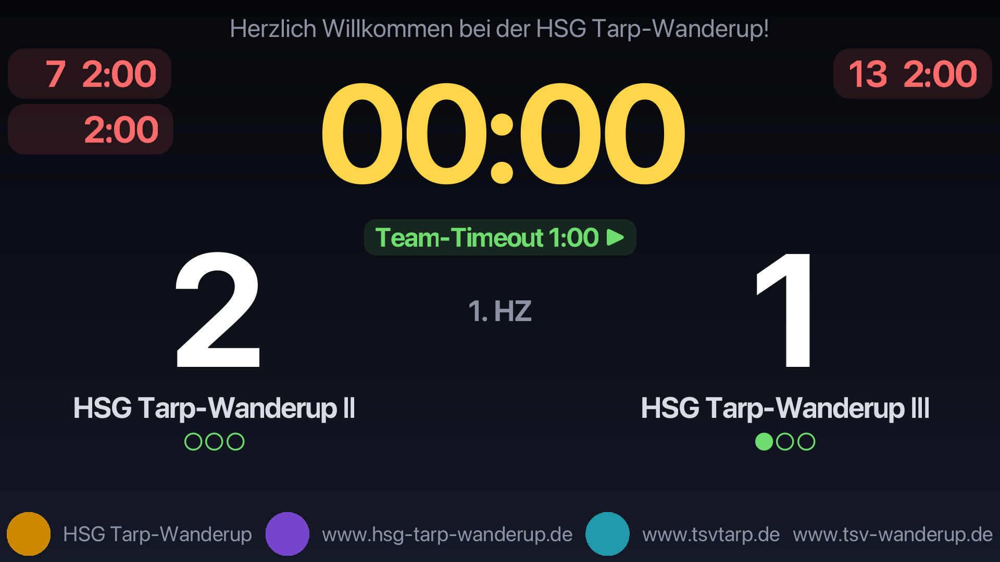

# Spielstandsanzeige

> **English summary:** A JavaFX desktop scoreboard for handball (extensible to
> other sports) with two windows — an operator console for the timekeeper's desk
> and a spectator display for a projector or second screen (full screen).
> Features: game clock (count up or down, single period or two halves, automatic
> stop with horn), scores, 2-minute penalties with optional player number, team
> timeouts with quota display, and a persistent team-name database. Run with `mvn javafx:run`; GitHub releases include a
> self-contained Windows installer (no Java required). The documentation below
> is in German.

JavaFX-Desktopanwendung für Handball (erweiterbar für andere Sportarten) mit zwei Fenstern:

- **Kampfgericht-Konsole** — Spiel-Setup und Steuerung (Uhr, Tore, Zeitstrafen,
  Team-Timeouts, Hupe)
- **Publikumsanzeige** — große Anzeige für Beamer/zweiten Monitor (Vollbild)



Eine Schritt-für-Schritt-Anleitung für Anwender (Installation, Anzeige auf den
zweiten Bildschirm bringen, Konfiguration) steht in
[docs/anleitung.md](docs/anleitung.md).

## Starten

Voraussetzungen: JDK 21+ (entwickelt mit JDK 25) und Maven.

```sh
mvn javafx:run
```

## Bedienung

1. In der Konsole Teamnamen (Dropdown mit Textfilter über alle bereits genutzten
   Teams, freie Eingabe für neue), Modus (eine Spielzeit / zwei Halbzeiten),
   Periodendauer und Uhrrichtung (vorwärts/rückwärts) einstellen, dann
   **„Spiel anlegen“**. Teamnamen werden unter `~/.spielstandsanzeige/`
   gespeichert und beim nächsten Spiel automatisch vorgeschlagen.
2. Zielbildschirm wählen und **„Anzeige öffnen“** (auf einem zweiten Bildschirm
   automatisch im Vollbild; **„Vollbild umschalten“** bzw. ESC am Anzeigefenster).
3. **Start / Pause / Fortsetzen** steuert die Uhr; bei Halbzeit- und Spielende stoppt
   sie automatisch und die Hupe ertönt. Die 2. Halbzeit wird manuell gestartet.
   **„Zeit stellen…“** korrigiert die Spielzeit manuell (Eingabe im Anzeigeformat
   der Uhr, begrenzt auf die aktuelle Periode) — auch aus der Halbzeitpause
   heraus, falls die Uhr zu spät gestoppt wurde.
4. Pro Team: **+1 Tor / −1 Tor** (nie unter 0) und **„2 Minuten“** für Zeitstrafen —
   optional mit Trikotnummer (Feld „Nr.“). Zeitstrafen sind an die Spieluhr gekoppelt
   (pausieren mit), verschwinden bei Ablauf automatisch und lassen sich am
   Kampfgericht mit einem einfachen Klick auf den Counter abbrechen — genau wie
   ein laufendes Team-Timeout.
5. **Team-Timeout** pro Team: hält die Spieluhr an und startet einen 1-Minuten-Countdown
   in Echtzeit (Hupe bei Ablauf, vorzeitig beendbar). Das Spiel bleibt unterbrochen,
   bis das Kampfgericht es mit **„Fortsetzen“** wieder startet — das beendet auch ein
   noch laufendes Timeout. Genutzte Timeouts werden als Punkte (●●○, 3 pro Spiel)
   angezeigt, aber nicht blockiert — das Kampfgericht entscheidet.
6. **„Spiel abbrechen“** (mit Rückfrage) beendet das Spiel sofort und endgültig —
   die Uhr stoppt bei der aktuellen Zeit, ein neues Spiel kann direkt angelegt werden.
7. **„Konfiguration…“** öffnet das Konfigurationsfenster der Anzeige: ein **Header**
   (oben) und ein **Footer** (unten), jeweils ein festes Raster aus bis zu 6 Texten
   und 5 Bildern im Wechsel (Text 1, Bild 1, Text 2, …, Bild 5, Text 6) — leere
   Slots rücken zusammen, ohne Inhalt ist der Banner ausgeblendet. Bilder per Datei
   oder URL (werden in die Datenbank kopiert). Dazu **alle Farben der Anzeige** per
   Farbwähler, die **Schriftart** der Anzeige und **Schriftgrößen-Regler** für
   Header, Footer, Uhr, Tore und Teamnamen (50–250 %): bei Header/Footer skaliert
   der Regler Banner-Schrift und Höhenanteil gemeinsam (100 % = ein Zehntel der
   Fensterhöhe), innerhalb des Spielstands bestimmen die Regler das
   Größenverhältnis von Uhr, Toren und Teamnamen zueinander — Änderungen wirken
   sofort auf Anzeige und Kampfgericht und bleiben über Neustarts erhalten. Die
   Auswahl lässt sich als benanntes **Theme** speichern, laden und löschen;
   „Standardfarben“ setzt auf die Voreinstellung zurück. Für die **Hupe** stehen
   fünf eingebaute Töne zur Wahl oder eine eigene Audiodatei (WAV/AIFF/AU).
   Der Inhalt des Konfigurationsfensters scrollt vertikal; das Fenster öffnet
   höchstens bildschirmhoch und bleibt so auch auf kleinen Auflösungen
   bedienbar.

Wie sich das Raster der Anzeige zusammensetzt (Zonen, Zeilengewichte,
Schriftgrößen-Formeln), beschreibt [docs/layout.md](docs/layout.md).

## Tests

```sh
mvn test
```

Das Model (Uhr, Zeitstrafen, Spielstand) ist UI-frei und vollständig per Unit-Tests
mit einer Fake-Zeitquelle abgedeckt.

## Windows-Release (EXE)

Beim Veröffentlichen eines GitHub-Releases baut der Workflow
`.github/workflows/release-windows.yml` automatisch zwei Windows-Artefakte mit
eingebetteter Java-Runtime (es muss **kein Java installiert** sein) und hängt sie
an das Release an:

- `Spielstandsanzeige-<version>.exe` — Installer (ohne Adminrechte, mit Startmenü-Eintrag)
- `Spielstandsanzeige-<version>-windows-portable.zip` — entpacken und
  `Spielstandsanzeige.exe` direkt starten (z. B. vom USB-Stick)

Release-Tags im Format `v1.2.3` mit Hauptversion ≥ 1 verwenden (Vorgabe von
jpackage). Hinweis: Die EXE ist nicht signiert — Windows SmartScreen zeigt beim
ersten Start eine Warnung, die sich über „Weitere Informationen → Trotzdem
ausführen" bestätigen lässt.

## Andere Sportarten

Vorgabewerte (Periodendauer, Strafzeitlänge) stehen in
`src/main/java/de/kmost/scoreboard/model/SportProfile.java` — weitere Sportarten
werden dort als zusätzliche Konstanten ergänzt.

## Gespeicherte Daten

Die App legt Teamnamen unter `~/.spielstandsanzeige/` ab (`teams.properties`),
dazu die aktive Anzeige-Konfiguration (`display.properties`: Farben +
Header/Footer), Banner-Bilder (`banners/`), gespeicherte Farb-Themes
(`themes/`) und die Hupen-Auswahl (`horn.properties`). Der Ordner kann
gefahrlos gelöscht werden, um alles zurückzusetzen.

## Mitwirken

Fehlermeldungen, Ideen und Pull Requests sind willkommen — Details in
[CONTRIBUTING.md](CONTRIBUTING.md).

## Lizenz

Dieses Projekt steht unter der [MIT-Lizenz](LICENSE).

Verwendete Abhängigkeiten:

- [OpenJFX (JavaFX)](https://openjfx.io) — GPLv2 mit Classpath Exception
- [JUnit 5](https://junit.org) — EPL 2.0 (nur für Tests)

Die Windows-Pakete aus dem Release-Workflow bündeln eine
[Eclipse-Temurin](https://adoptium.net)-Java-Runtime (GPLv2 mit Classpath
Exception).
