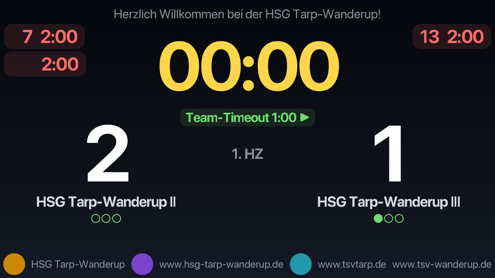

# Spielstandsanzeige – Anleitung

Diese Anleitung führt Schritt für Schritt von der Installation bis zur laufenden
Anzeige auf dem Beamer bzw. zweiten Bildschirm. Es sind keine Technikkenntnisse
nötig.

## 1. Installation (nur einmal nötig)

1. Öffnen Sie im Browser diese Seite:
   **https://github.com/kmost/spielstandsanzeige/releases/latest**
2. Klicken Sie dort unter „Assets“ auf die Datei **`Spielstandsanzeige-….exe`**
   und warten Sie, bis der Download fertig ist.
3. Starten Sie die heruntergeladene Datei per Doppelklick.
   Falls Windows eine blaue Warnung anzeigt („Der Computer wurde durch Windows
   geschützt“): auf **„Weitere Informationen“** und dann auf
   **„Trotzdem ausführen“** klicken. Das ist normal, weil das Programm nicht
   kommerziell signiert ist.
4. Dem Installationsfenster folgen — Administratorrechte werden nicht benötigt.
   Danach finden Sie **„Spielstandsanzeige“** im Startmenü.

## 2. Beamer oder zweiten Bildschirm anschließen

1. Schließen Sie den Beamer bzw. Monitor per Kabel (meist HDMI) an den Laptop an
   und schalten Sie ihn ein.
2. Drücken Sie die **Windows-Taste + P** und wählen Sie **„Erweitern“**.
   Wichtig: nicht „Duplizieren“ — nur bei „Erweitern“ ist der Beamer ein
   eigener, zweiter Bildschirm, auf dem die Anzeige laufen kann, während Sie am
   Laptop weiter das Bedienfenster sehen.

## 3. Programm starten und Spiel anlegen

1. Starten Sie **Spielstandsanzeige** über das Startmenü. Es öffnet sich das
   Fenster **„Kampfgericht“** — hier wird alles bedient.
2. Tragen Sie die beiden Teamnamen ein (bereits verwendete Namen werden beim
   Tippen vorgeschlagen) und prüfen Sie Spielmodus und Periodendauer. Bei
   **„Uhr“** wählen Sie, ob die Spieluhr **vorwärts** (0:00 → Ende) oder
   **rückwärts** (Ende → 0:00) läuft. Unter **„Verlängerung (falls nötig)“**
   ist voreingestellt, wie eine eventuelle Verlängerung gespielt würde
   (Standard: zwei Halbzeiten à 5 Minuten) — das muss Sie nur kümmern, wenn
   ein Unentschieden entschieden werden muss.
3. Klicken Sie auf **„Spiel anlegen“**.

## 4. Anzeige auf den zweiten Bildschirm bringen

1. Im Bereich **„Publikumsanzeige“** ist der zweite Bildschirm in der Auswahl
   normalerweise schon vorgewählt (z. B. „Bildschirm 2“). Falls nicht, wählen
   Sie ihn dort aus.
2. Klicken Sie auf **„🖥 Anzeige öffnen“**. Die Anzeige erscheint automatisch
   **im Vollbild** auf dem zweiten Bildschirm — fertig.
3. Falls die Anzeige einmal nicht im Vollbild ist oder auf dem falschen
   Bildschirm liegt: **„⛶ Vollbild umschalten“** klicken bzw. in der Auswahl den
   richtigen Bildschirm wählen und erneut auf „Anzeige öffnen“ klicken.
   Die Taste **ESC** beendet das Vollbild.

## 5. Während des Spiels

- **Start / Pause / Fortsetzen** steuert die Spieluhr. Am Ende jedes
  Spielabschnitts stoppt die Uhr automatisch und die Hupe ertönt; den nächsten
  Abschnitt (2. Halbzeit bzw. 2./3. Drittel) starten Sie manuell.
- Pro Team: **+1 Tor / −1 Tor**, **„2 Minuten“** für Zeitstrafen (optional mit
  Trikotnummer) und **Team-Timeout** (1-Minuten-Countdown mit Hupe). Jedes Team
  hat drei Timeouts pro Spiel; die Punkte neben dem Knopf zeigen, wie viele noch
  übrig sind.
- Laufende Zeitstrafen sind im Kampfgericht und auf der Anzeige sichtbar. Eine
  versehentlich gestartete Zeitstrafe brechen Sie mit einem Klick auf ihre
  Zeile im Kampfgericht ab. Mit **„→ 4 Min“** neben der Zeile verlängern Sie eine
  laufende 2-Minuten-Strafe auf insgesamt 4 Minuten (einmal je Strafe).
- Der Spielstand wird laufend gesichert (`~/.spielstandsanzeige/game.properties`).
  Nach einem Absturz oder Neustart fragt die App beim Start, ob das laufende
  Spiel **fortgesetzt** oder verworfen werden soll. Die Uhr steht dann auf der
  zuletzt gesicherten Zeit (die Ausfallzeit zählt nicht) und wird mit
  „Fortsetzen“ weitergestartet; ein gerade laufendes Team-Timeout läuft nicht
  weiter. Das Schließen des Fensters fragt nach, solange das Spiel nicht beendet
  ist. Ein beendetes oder abgebrochenes Spiel wird nicht mehr gesichert.
- Geht beim Speichern oder Laden etwas schief (z. B. Teams, Themes, Spielstand
  oder Hupe), erscheint am unteren Rand des Kampfgerichts für einige Sekunden eine
  rote Meldung. Das Spiel läuft weiter. Einzelheiten stehen in der Logdatei
  `~/.spielstandsanzeige/spielstandsanzeige.log`.
- **„Zeit stellen…“** korrigiert die Uhr, falls sie zu spät gestartet oder
  gestoppt wurde.
- Steht es nach dem regulären Spielende unentschieden und muss ein Sieger
  ermittelt werden: Klicken Sie beim Wiederanpfiff auf **„▶ 1. Verlängerung
  starten“** — die Uhr läuft dann einfach weiter (z. B. 60:00 → 70:00), die
  Anzeige zeigt „1. Verlängerung“. Bei erneutem Gleichstand ist danach eine
  **2. Verlängerung** möglich, und so weiter.
- Soll stattdessen (oder nach den Verlängerungen) ein **7-m-Werfen**
  entscheiden: **„🥅 7-m-Werfen…“** klicken und das beginnende Team wählen.
  Danach zeigt das Programm an, wer wirft — Sie melden nur noch **„Tor“**
  oder **„Kein Tor“**. Den Wechsel der Schützen, das vorzeitige Ende bei
  uneinholbarem Vorsprung, das Sudden Death nach 5 Schützen je Team und die
  Siegermeldung übernimmt das Programm. Jeder Treffer zählt aufs
  Endergebnis; die Anzeige zeigt die Trefferfolge unter den Teamnamen
  (● Tor, ○ Fehlwurf). Eine Fehleingabe machen Sie mit **„↩ Wurf
  zurücknehmen“** rückgängig.
- Soll das **Unentschieden stehen bleiben**, beenden Sie das Spiel mit
  **„🏁 Beenden“** (mit Rückfrage). Der Knopf erscheint nur bei Gleichstand nach
  dem regulären Spielende, solange weder Verlängerung noch 7-m-Werfen gestartet
  wurden. Danach sind beide gesperrt, das Spiel zählt als beendet: Es wird nicht
  mehr zum Fortsetzen angeboten, und das Schließen des Fensters fragt nicht mehr nach.
- **„📢 Hupe“** löst die Hupe von Hand aus, z. B. zur Ankündigung des
  Wiederanpfiffs.
- **„⏹ Spiel abbrechen“** beendet das Spiel vorzeitig — die Uhr stoppt nach
  einer Rückfrage endgültig.

## Konfiguration

Über den Knopf **„Konfiguration…“** im Kampfgericht-Fenster lässt sich das
Aussehen der Publikumsanzeige anpassen: alle **Farben** und die **Schriftart**,
die **Schriftgrößen** von Uhr, Toren und Teamnamen per Regler sowie ein
**Header und Footer** mit eigenen Texten und Bildern — zum Beispiel
Vereinslogo, Hallenname oder Sponsoren. Bilder lassen sich aus einer Datei oder
per **„🌐 URL…“** aus dem Internet übernehmen; das Laden läuft im Hintergrund
(mit „Abbrechen“), erlaubt sind nur **https**-Adressen und Bilder bis 10 MB im
Format PNG, JPG oder GIF. Auch der **Hupenton** ist wählbar
(fünf eingebaute Töne oder eine eigene Audiodatei). Jede Änderung ist sofort
auf der Anzeige sichtbar und bleibt auch nach einem Neustart des Programms
erhalten. Eine fertige Gestaltung kann als benanntes **Theme** gespeichert und
später wieder geladen werden; „Standardfarben“ setzt alles auf die
Voreinstellung zurück.
